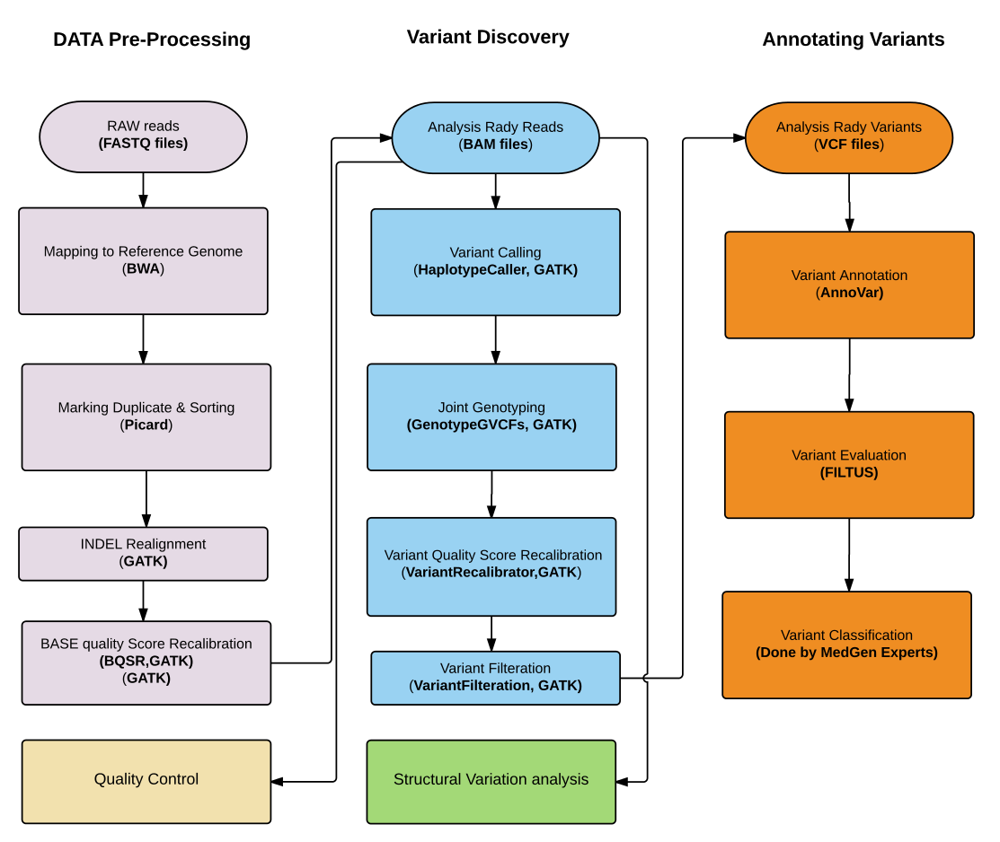

### Genomics
This folder contains implementations of genomics related tools.
All of the tools uses [Apache Spark](http://spark.apache.org/) to distribute
the workload.

Currently all of the tools does this by dividing the input into smaller chunks,
and then running the tools on each chunk. By doing so we are able to provide
a familiar interface, while (in most cases) improving the performance of each
tool.

### Requirements
* Indexed FASTA reference files (as normally required in the GATK pipeline).
* dbSNP files for the reference (the one for HG19 can be found
  [here](ftp://ftp.broadinstitute.org/bundle/2.8/hg19/)).
* Known, truth, and training sets to be used when performing
  [VQSR](https://www.broadinstitute.org/gatk/gatkdocs/org_broadinstitute_gatk_tools_walkers_variantrecalibration_VariantRecalibrator.php).
* It is preferred that HDFS is mounted using FUSE, as this makes it a lot
  easier to distribute the reference etc. to the nodes in the cluster.

